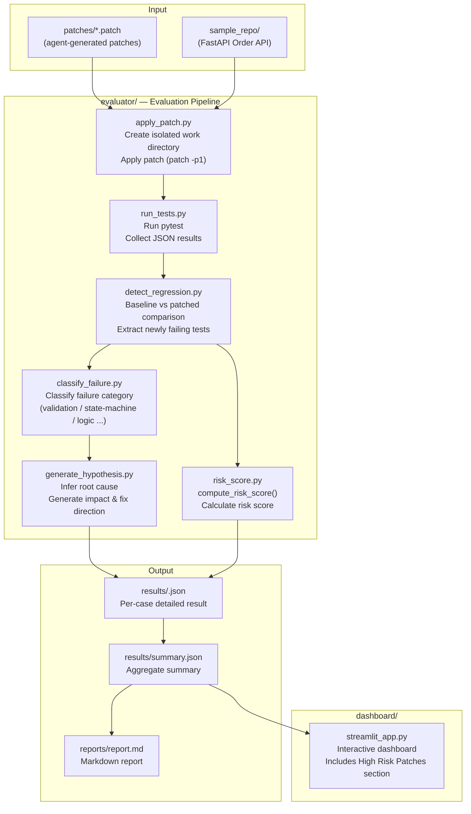

# AI Reliability Platform

[](https://github.com/Ellie023/ai-reliability-platform)
[](https://www.python.org/)
[](https://fastapi.tiangolo.com/)
[](https://streamlit.io/)
[](sample_repo/tests/test_order_service.py)
[](LICENSE)

> Repository: **https://github.com/Ellie023/ai-reliability-platform**

---

## Problem Definition — AI Agent Code Reliability

LLM-based AI agents autonomously generate code patches. However, most systems lack a **mechanism to guarantee that agent-generated code is actually safe**.

- Unintended **regressions** introduced by agents go undetected.
- The **root cause** of failures is hard to pinpoint.
- There is no basis for **prioritizing** which patches are dangerous.

This platform provides an evaluation loop that **automatically assesses patches proposed by AI agents, detects regressions, and quantifies risk**. It acts as a **safety gate** that autonomous coding agents must pass before their changes are merged.

## 문제 정의 — AI 에이전트 코드의 신뢰성

LLM 기반 AI 에이전트는 코드 패치를 자율적으로 생성합니다. 그러나 **에이전트가 생성한 코드가 실제로 안전한지 보장하는 메커니즘**은 대부분의 시스템에서 부재합니다.

- 에이전트가 의도치 않은 **회귀(regression)** 를 일으켜도 탐지되지 않는다.
- 실패의 **근본 원인(root cause)** 을 파악하기 어렵다.
- 어떤 패치가 위험한지 **우선순위**를 정할 기준이 없다.

이 플랫폼은 AI 에이전트가 제안한 패치를 **자동으로 평가하고, 회귀를 탐지하며, 위험도를 수치화**하는 평가 루프를 제공합니다. 자율 코딩 에이전트가 변경 사항을 머지하기 전에 반드시 통과해야 하는 **안전망(safety gate)** 역할을 합니다.

---

## Core Features

| Feature | Description |
|---------|-------------|
| **Isolated patch application** | Creates a clean copy of `sample_repo` and applies each patch independently |
| **Automated test execution** | Runs pytest and collects results as a JSON report |
| **Regression detection** | Precisely identifies tests that newly fail compared to the clean baseline |
| **Failure classification** | Maps regressions to categories: validation error, state-machine error, logic error, etc. |
| **Root-cause hypothesis** | Automatically infers cause, impact, and fix direction from failure patterns |
| **Risk Score** | Produces a single numeric score from regression, failure count, timeout, and changed files |
| **Streamlit dashboard** | Interactively visualizes per-patch results, high-risk patches, and detailed analysis |

## 핵심 기능

| 기능 | 설명 |
|------|------|
| **패치 격리 적용** | `sample_repo`의 깨끗한 사본을 만들고 각 패치를 독립적으로 적용 |
| **자동 테스트 실행** | pytest를 실행하고 JSON 리포트로 결과를 수집 |
| **회귀 탐지** | 베이스라인 대비 새롭게 실패한 테스트를 정밀하게 식별 |
| **실패 분류** | 회귀를 검증 오류·상태 머신 오류·로직 오류 등 카테고리로 분류 |
| **근본 원인 가설 생성** | 실패 패턴으로부터 원인·영향도·수정 방향을 자동 추론 |
| **위험도 점수(Risk Score)** | 회귀·실패 수·타임아웃·변경 파일 수를 종합한 숫자 점수 산출 |
| **Streamlit 대시보드** | 패치별 결과, 고위험 패치, 상세 분석을 인터랙티브하게 시각화 |

---

## Architecture



### Risk Score Calculation

```
risk_score = 0
  + 50   if regression detected
  + 10   × failed_tests count
  + 20   if test run timed out
  + 10   if changed_files >= 3

risk_level = HIGH   if score >= 50
           = MEDIUM if score >= 20
           = LOW    otherwise
```

## 아키텍처

Mermaid 다이어그램은 위 영문 섹션을 참조하세요 (동일한 파이프라인 구조).

### 위험도 점수 계산

```
risk_score = 0
  + 50   회귀 탐지 시
  + 10   × 실패 테스트 수
  + 20   타임아웃 발생 시
  + 10   변경 파일 3개 이상 시

risk_level = HIGH   (score >= 50)
           = MEDIUM (score >= 20)
           = LOW    (그 외)
```

---

## Project Layout

```
ai-reliability-platform/
├── sample_repo/                    # System under test (FastAPI Order API)
│   ├── app/
│   │   ├── models.py               # Pydantic models + OrderStatus enum
│   │   ├── order_service.py        # Business logic (validation, discount, state machine)
│   │   └── main.py                 # FastAPI endpoints
│   └── tests/
│       └── test_order_service.py   # 18 pytest tests
├── patches/                        # Agent-generated patches to evaluate
│   ├── agent_case_01.patch         # BUG: empty order allowed
│   ├── agent_case_02.patch         # BUG: discount > 100% allowed
│   ├── agent_case_03.patch         # BUG: negative price allowed
│   ├── agent_case_04.patch         # BUG: invalid status transition allowed
│   ├── agent_case_05.patch         # OK : adds count_items() helper (no regression)
│   └── agent_case_06.patch         # OK : adds can_cancel() helper (no regression)
├── evaluator/
│   ├── apply_patch.py              # Create work copy + apply patch
│   ├── run_tests.py                # Run pytest + parse JSON report
│   ├── detect_regression.py        # Baseline vs patched comparison
│   ├── classify_failure.py         # Failure classification (category/label)
│   ├── generate_hypothesis.py      # Root cause + fix direction inference
│   ├── risk_score.py               # compute_risk_score() implementation
│   └── generate_report.py          # Pipeline orchestrator
├── dashboard/
│   └── streamlit_app.py            # Interactive dashboard
├── reports/                        # Generated Markdown report
├── results/                        # Generated per-case + summary JSON
├── requirements.txt
└── README.md
```

## 프로젝트 구조

```
ai-reliability-platform/
├── sample_repo/                    # 평가 대상 시스템 (FastAPI Order API)
│   ├── app/
│   │   ├── models.py               # Pydantic 모델 + OrderStatus enum
│   │   ├── order_service.py        # 비즈니스 로직 (검증, 할인, 상태 머신)
│   │   └── main.py                 # FastAPI 엔드포인트
│   └── tests/
│       └── test_order_service.py   # pytest 18개 테스트
├── patches/                        # 에이전트 생성 패치
│   ├── agent_case_01.patch         # BUG: 빈 주문 허용
│   ├── agent_case_02.patch         # BUG: 100% 초과 할인 허용
│   ├── agent_case_03.patch         # BUG: 음수 가격 허용
│   ├── agent_case_04.patch         # BUG: 잘못된 상태 전환 허용
│   ├── agent_case_05.patch         # OK : count_items() 헬퍼 추가
│   └── agent_case_06.patch         # OK : can_cancel() 헬퍼 추가
├── evaluator/
│   ├── apply_patch.py              # 작업 사본 생성 + 패치 적용
│   ├── run_tests.py                # pytest 실행 + JSON 결과 파싱
│   ├── detect_regression.py        # 베이스라인 vs 패치 비교
│   ├── classify_failure.py         # 실패 분류 (카테고리/레이블)
│   ├── generate_hypothesis.py      # 근본 원인 + 수정 방향 추론
│   ├── risk_score.py               # compute_risk_score() 구현
│   └── generate_report.py          # 파이프라인 오케스트레이터
├── dashboard/
│   └── streamlit_app.py            # 인터랙티브 대시보드
├── reports/                        # 생성된 마크다운 리포트
├── results/                        # 생성된 JSON 결과
├── requirements.txt
└── README.md
```

---

## Getting Started

### 1. Setup

```bash
cd ~/ai-reliability-platform
python -m venv .venv && source .venv/bin/activate
pip install -r requirements.txt
```

### 2. Run the evaluation pipeline

```bash
python evaluator/generate_report.py
```

Output files:

- `results/<case>.json` — full per-patch result (regression, classification, hypothesis, risk)
- `results/summary.json` — aggregate counts (cases, regressions, high-risk)
- `reports/report.md` — human-readable Markdown report

Expected outcome: cases 01–04 → **REGRESSION** (with classified root cause), cases 05–06 → **SAFE**

### 3. Launch the dashboard

```bash
streamlit run dashboard/streamlit_app.py
```

Open `http://localhost:8501` in your browser. The **High Risk Patches** section immediately surfaces the most dangerous patches.

### 4. Run the sample API directly (optional)

```bash
cd sample_repo
uvicorn app.main:app --reload
# http://127.0.0.1:8000/docs
```

## 실행 방법

### 1. 환경 설정

```bash
cd ~/ai-reliability-platform
python -m venv .venv && source .venv/bin/activate
pip install -r requirements.txt
```

### 2. 평가 파이프라인 실행

```bash
python evaluator/generate_report.py
```

출력 파일:

- `results/<case>.json` — 패치별 상세 결과 (회귀, 분류, 가설, 위험도)
- `results/summary.json` — 전체 집계 (케이스 수, 회귀 수, 고위험 수)
- `reports/report.md` — 사람이 읽을 수 있는 마크다운 리포트

예상 결과: 케이스 01–04 → **REGRESSION** (분류된 원인 포함), 케이스 05–06 → **SAFE**

### 3. 대시보드 실행

```bash
streamlit run dashboard/streamlit_app.py
```

브라우저에서 `http://localhost:8501` 접속. High Risk Patches 섹션에서 위험도 높은 패치를 즉시 확인할 수 있습니다.

### 4. 샘플 API 직접 실행 (선택)

```bash
cd sample_repo
uvicorn app.main:app --reload
# http://127.0.0.1:8000/docs
```

---

## How a Patch is Judged

1. **Isolate** — copy `sample_repo/` to `results/_work/<case>/`
2. **Apply** — apply the candidate diff with `patch -p1`
3. **Test** — run pytest (JSON report)
4. **Detect** — extract newly failing tests vs the clean baseline
5. **Classify** — map failures to a category
6. **Hypothesize** — output cause, impact, severity, and fix direction
7. **Score** — compute risk score and assign HIGH / MEDIUM / LOW

A patch is **SAFE** only if it introduces **zero** new failing tests.

## 패치 판정 흐름

1. **Isolate** — `sample_repo/`를 `results/_work/<case>/`에 복사
2. **Apply** — `patch -p1`로 후보 패치 적용
3. **Test** — pytest 실행 (JSON 리포트)
4. **Detect** — 베이스라인 대비 신규 실패 테스트 추출
5. **Classify** — 실패를 카테고리로 매핑
6. **Hypothesize** — 원인·영향도·심각도·수정 방향 출력
7. **Score** — 위험도 점수 산출 및 HIGH/MEDIUM/LOW 분류

**SAFE** 판정은 신규 실패 테스트가 **0개**일 때만 부여됩니다.

---

## Roadmap

### Parallel evaluation with Kubernetes Jobs

The current pipeline evaluates patches sequentially in a single process. For hundreds of patches, each evaluation can be submitted as a **k8s Job** with results collected from object storage (S3/GCS).

```
Patch Queue → Job Dispatcher → k8s Job (per patch) → Results Aggregator
```

### Real GitHub PR integration

Instead of local `.patch` files in `patches/`, the pipeline can be extended to receive **diffs directly from GitHub Pull Requests**.

- GitHub Actions webhook → trigger evaluation pipeline
- Automatically post risk score and failure classification as PR comments
- Block merge for HIGH-risk PRs

### LLM-powered hypothesis generation

`generate_hypothesis.py` currently uses rule-based inference. Integrating the Claude API to pass actual code diffs and failure logs to an LLM enables richer root-cause analysis and more precise fix suggestions.

```python
response = anthropic.messages.create(
    model="claude-opus-4-8",
    messages=[{"role": "user", "content": f"Patch diff:\n{diff}\n\nFailing tests:\n{failures}\n\nRoot cause?"}]
)
```

## 확장 방향

### Kubernetes Job 기반 병렬 평가

현재는 단일 프로세스에서 순차적으로 패치를 평가합니다. 수백 개의 패치를 처리하려면 각 패치 평가를 **k8s Job**으로 제출하고 결과를 오브젝트 스토리지(S3/GCS)에서 수집하는 구조로 확장할 수 있습니다.

```
Patch Queue → Job Dispatcher → k8s Job (per patch) → Results Aggregator
```

### 실제 GitHub PR 연동

`patches/` 디렉토리의 로컬 `.patch` 파일 대신, **GitHub Pull Request의 diff**를 직접 수신하는 워크플로우로 확장할 수 있습니다.

- GitHub Actions webhook → 평가 파이프라인 트리거
- PR 코멘트에 위험도 점수 및 실패 분류 자동 게시
- HIGH risk PR은 자동으로 merge 차단

### LLM 기반 가설 고도화

현재 `generate_hypothesis.py`는 규칙 기반 추론을 사용합니다. Claude API를 연동해 실제 코드 변경 내용과 실패 로그를 LLM에 전달하면 더 정교한 근본 원인 분석과 수정 제안을 생성할 수 있습니다.

```python
response = anthropic.messages.create(
    model="claude-opus-4-8",
    messages=[{"role": "user", "content": f"Patch diff:\n{diff}\n\nFailing tests:\n{failures}\n\nRoot cause?"}]
)
```

---

## License

Released under the [MIT License](LICENSE).
